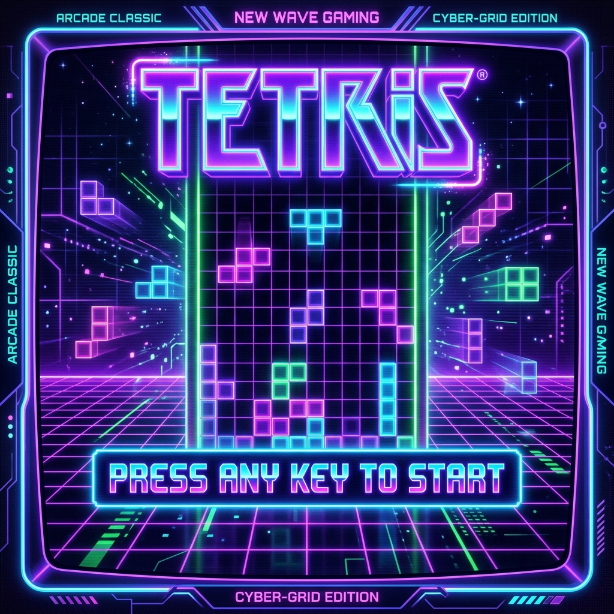
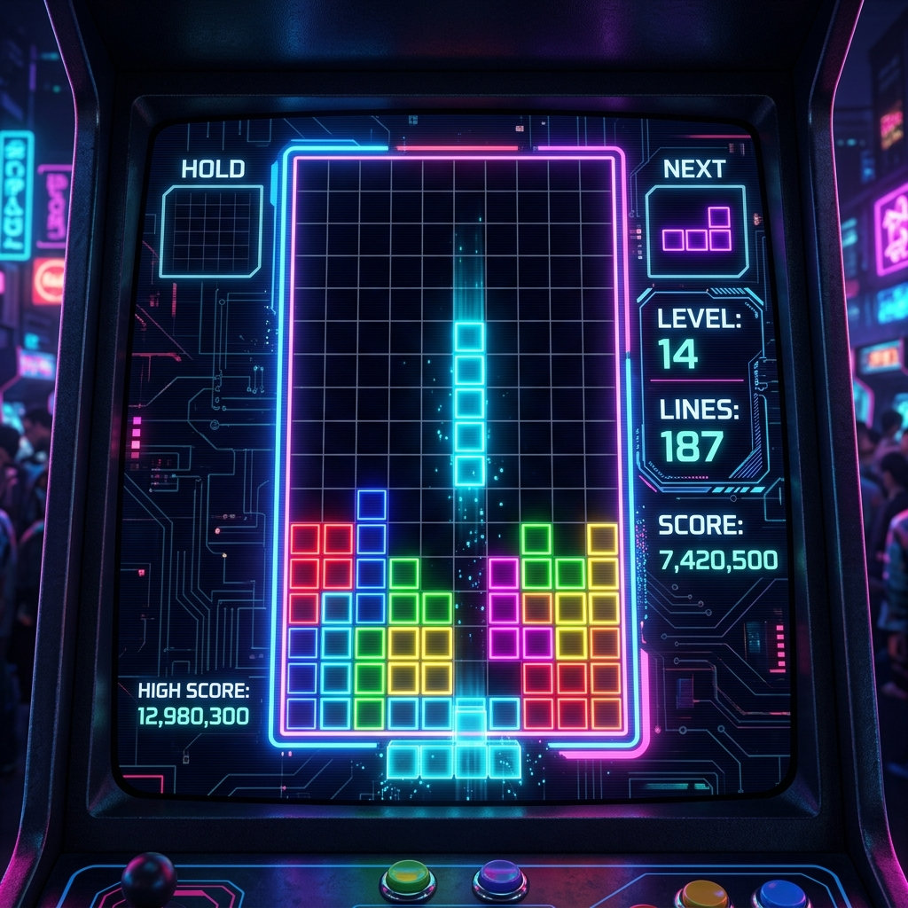
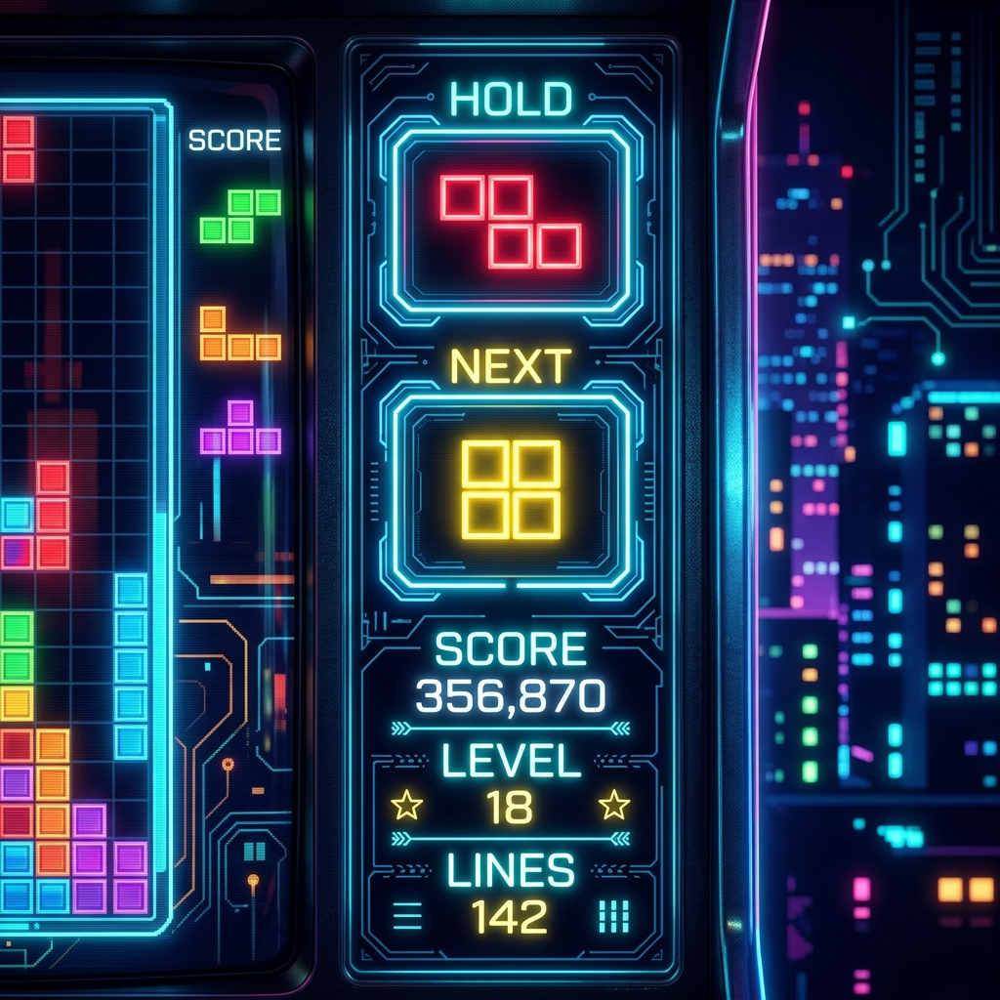

<p align="center">
  
  
  
  
</p>

<h1 align="center">🎮 Tetris — Classic Arcade Reimagined in C++</h1>

<p align="center">
  A highly-polished, feature-rich <strong>Tetris Arcade Clone</strong> rebuilt with modular, object-oriented <strong>C++17</strong> and rendered using the <strong>SFML 2.6.2</strong> graphics & audio engine.<br/>
  Vibrant neon aesthetics • Loop soundtrack • Advanced tactical mechanics • High score persistence
</p>

---

## 📸 Screenshots & Visuals

Here are three designated spaces to showcase the game's visuals. You can add pictures of your gameplay here by saving them in your repository and updating the image source paths:

<div align="center">
  <table>
    <tr>
      <td align="center" width="33%">
        <strong>1. Start & Title Screen</strong><br/><br/>
        <!-- SCREENSHOT PLACEHOLDER 1 -->
        <a href="#1-start--title-screen">
          
        </a><br/><br/>
        <sub>Vibrant hue-cycling title and drifting background shapes.</sub>
      </td>
      <td align="center" width="33%">
        <strong>2. Active Gameplay</strong><br/><br/>
        <!-- SCREENSHOT PLACEHOLDER 2 -->
        <a href="#2-active-gameplay">
          
        </a><br/><br/>
        <sub>Sleek dark grid playfield, dropping block, and translucent landing shadow.</sub>
      </td>
      <td align="center" width="33%">
        <strong>3. Next & Hold Sidebar</strong><br/><br/>
        <!-- SCREENSHOT PLACEHOLDER 3 -->
        <a href="#3-next--hold-sidebar">
          
        </a><br/><br/>
        <sub>Interactive HUD showing hold slot, centered next preview, and stats.</sub>
      </td>
    </tr>
  </table>
</div>

---

## ✨ Advanced Features

* **Modern Object-Oriented C++ Architecture**: Completely refactored from a single monolithic file into a clean, modular design.
* **Ambient Background Animations**: Drifting, rotating background tetrominoes on the Start Screen backed by a retro cyber-grid mesh.
* **Pulsing Start Prompt & Title**: Smooth neon color hue-cycling title text (`TETRIS`) with shadow depth and pulsing play prompt.
* **Interactive HUD Sidebar (Next & Hold Slots)**:
  * **Hold Piece Functionality (C / Left Shift)**: Reserve a piece in the hold slot and swap it later (restricted to once per turn).
  * **Next-Piece Preview Panel**: View the upcoming tetromino centered beautifully using a custom centroid-bounding box algorithm.
* **Tactical Hard Drop (Spacebar)**: Instantly drops and locks the active piece with an authentic drop score bonus.
* **Ghost Piece landing shadow**: Displays a translucent, color-matched projection shadow of the active piece showing where it will land.
* **Dynamic Level Progression**: Difficulty speeds scale smoothly up every 10 lines cleared.
* **Loop Soundtrack & Audio**: SoundManager handles background theme loop stream (`bb.mp3`), line clear chime (`li.mp3`), and game-over alert (`go.mp3`).

---

## 🕹️ Controls Guide

| Key | Action |
|---|---|
| `←` Left Arrow | Move piece left |
| `→` Right Arrow | Move piece right |
| `↑` Up Arrow | Rotate piece (90° Clockwise) |
| `↓` Down Arrow | Soft drop (fast continuous descent) |
| `Spacebar` | **Hard Drop** (instant placement & lock) |
| `C` or `LShift` | **Hold Piece** (swap active with hold slot) |
| `P` or `Esc` | Pause / Unpause gameplay |

---

## 🏗️ Architecture Design Pattern

```
                  ┌──────────────────────┐
                  │      Game Entry      │
                  │ (ConsoleApplication) │
                  └──────────┬───────────┘
                             │
                             ▼
                  ┌──────────────────────┐
                  │     Game Engine      │◄────────────────────────┐
                  │       (Game)         │                         │
                  └────┬────────────┬────┘                         │
                       │            │                              │
                       ▼            ▼                              ▼
            ┌─────────────┐  ┌─────────────┐             ┌──────────────────┐
            │ Playfield   │  │ Tetromino   │             │   Audio Stream   │
            │  (Board)    │  │  (Active)   │             │  (SoundManager)  │
            └─────────────┘  └─────────────┘             └──────────────────┘
```

The game is separated into distinct C++ components for maintainability and scalability:
1. [Common.h](Common.h) — Shared data structures, constants, neon color palettes, and shape data.
2. [Tetromino](Tetromino.h) — Class managing individual piece geometry, spawning, translations, and rotation states.
3. [Board](Board.h) — Class managing the playing field matrix, collision checks, line clears, scoring, and high score saving.
4. [SoundManager](SoundManager.h) — Class encapsulating SFML audio channels for effects and looping background music.
5. [Game](Game.h) — Class orchestrating the game loop, events, timing, GUI rendering, and Start/GameOver scenes.

---

## ⚙️ Getting Started

### Prerequisites
* **Visual Studio 2022** (with *Desktop Development with C++* workload)
* **SFML 2.6.2** (x64 binaries included in `SFML-2.6.2/`)
* **Platform**: Windows 10/11 (x64)

### Build & Run
1. Double-click `ConsoleApplication4.sln` to open in Visual Studio 2022.
2. Set build configuration to **Debug** or **Release** and architecture to **x64**.
3. Press **F5** or click the **Local Windows Debugger** button to build and launch the game.

> [!IMPORTANT]
> Make sure the required SFML asset files (`bb.mp3`, `li.mp3`, `go.mp3`, `arial.ttf`) and DLLs (`sfml-graphics-2.dll`, `sfml-audio-2.dll`, `openal32.dll` etc.) are located in the working directory from which your compiled binary launches.

---

## 👩‍💻 Developer

**Asma Shoukat**
